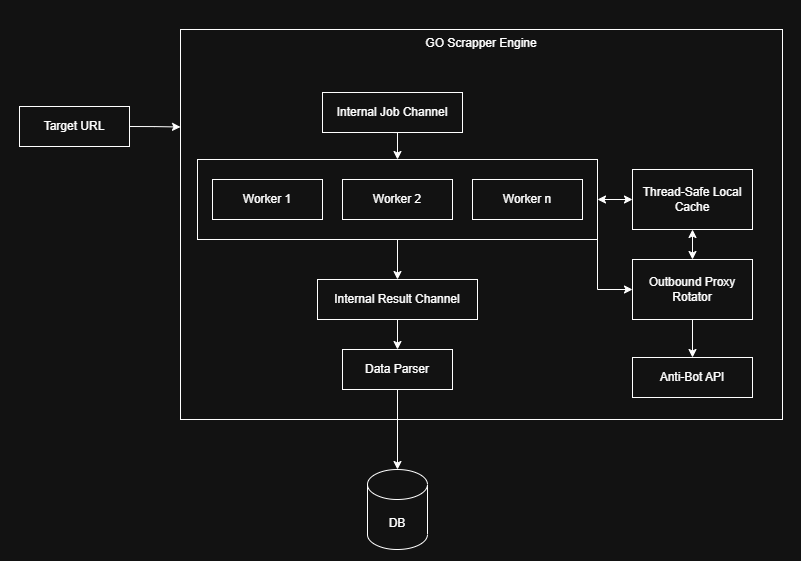

# GO Scrapper Engine — Design Document

## 1. Overview

The GO Scrapper Engine is a concurrent web scraping system written in Go. It accepts target URLs, distributes scraping work across a pool of workers, evades anti-bot defenses through a rotating proxy layer, parses fetched content, and persists structured results to a database. The design favors high throughput via Go's goroutines and channels while isolating networking concerns (caching, proxy rotation, anti-bot evasion) from the core worker pipeline.

## 2. Goals

- Scrape large volumes of target URLs concurrently and reliably.
- Minimize redundant network calls through local caching.
- Evade rate-limiting and anti-bot measures via proxy rotation and an anti-bot API.
- Decouple job intake, fetching, and parsing stages so each can scale or fail independently.
- Persist clean, structured data to a database for downstream use.

## 4. Architecture Summary

The system is organized into two cooperating subsystems inside a single engine boundary:

1. **Job Pipeline** — Target URL intake → job queue → worker pool → result queue → parser → DB.
2. **Network Support Layer** — Thread-safe local cache, outbound proxy rotator, and anti-bot API, all consulted by workers during fetch.

## 5. Component Breakdown

### 5.1 Target URL (Input)

External entry point. URLs to be scraped are submitted to the engine and enqueued onto the Internal Job Channel.

### 5.2 Internal Job Channel

A Go channel acting as the work queue between the producer (URL intake) and the worker pool. Buffered to absorb bursts and to decouple submission rate from processing rate.

### 5.3 Worker Pool (Worker 1 … Worker n)

A fixed or dynamically sized pool of goroutines that each:

- Pull a job (URL) from the Internal Job Channel.
- Check the Thread-Safe Local Cache for a recent/cached response before making a network call.
- If not cached, request an egress route from the Outbound Proxy Rotator and issue the HTTP fetch.
- Push raw results onto the Internal Result Channel.

Worker count `n` is tunable to balance throughput against target-site rate limits and local resource usage.

### 5.4 Thread-Safe Local Cache

An in-memory, mutex/sync-map-protected cache shared by all workers. Used to:

- Avoid re-fetching recently scraped URLs.
- Store proxy health/availability state shared with the Outbound Proxy Rotator (bidirectional arrow in the diagram indicates workers read/write the cache and the rotator reads/writes it too).

### 5.5 Outbound Proxy Rotator

Selects an outbound proxy (round-robin, weighted, or health-based) for each outbound request, consults/updates the Thread-Safe Local Cache for proxy health and session affinity, and forwards requests through the Anti-Bot API when additional evasion (headers, fingerprinting, CAPTCHA handling) is required.

### 5.6 Anti-Bot API

An external or internal service that handles anti-bot countermeasures (e.g., browser fingerprint spoofing, CAPTCHA solving, header/cookie management) on behalf of the proxy rotator before a request reaches the target site.

### 5.7 Internal Result Channel

A Go channel carrying raw fetch results (HTML/JSON payloads plus metadata) from workers to the Data Parser, decoupling fetch throughput from parse throughput.

### 5.8 Data Parser

Consumes raw results from the Internal Result Channel, extracts structured fields, normalizes/validates data, and writes the output to the database.

### 5.9 DB

Final persistence layer for parsed, structured scrape results.

## 6. Data Flow

1. A Target URL is submitted and pushed onto the Internal Job Channel.
2. An available worker pulls the job.
3. The worker checks the Thread-Safe Local Cache; on a cache hit, it skips the network call and proceeds directly to result emission.
4. On a cache miss, the worker requests a proxy from the Outbound Proxy Rotator.
5. The rotator selects a proxy (using cache-stored health/session data) and, if needed, routes the request through the Anti-Bot API for evasion handling.
6. The worker performs the fetch and pushes the raw response onto the Internal Result Channel.
7. The Data Parser consumes the result, extracts structured data, and writes it to the DB.

## 7. Concurrency Model

- **Channels as queues**: The Internal Job Channel and Internal Result Channel are the only hand-off points between pipeline stages, keeping coupling low and making backpressure explicit (a full channel naturally throttles upstream producers).
- **Worker pool**: A bounded set of goroutines consumes from the job channel, providing controlled concurrency rather than spawning one goroutine per URL.
- **Shared cache safety**: The Thread-Safe Local Cache must support concurrent reads/writes (e.g., `sync.RWMutex` or `sync.Map`) since it is accessed by all workers and the proxy rotator simultaneously.
- **Parser as separate stage**: Running the Data Parser as its own consumer (rather than inline in each worker) allows fetch and parse to scale independently — e.g., more fetch workers than parser instances if parsing is cheap, or vice versa.

## 8. Reliability & Failure Handling Considerations

- **Channel buffering**: Size the Internal Job and Result Channels to absorb short bursts without blocking producers indefinitely; pair with timeouts/context cancellation per job to avoid goroutine leaks.
- **Proxy failure**: The Outbound Proxy Rotator should mark unhealthy proxies (via the shared cache) and retry on an alternate proxy rather than failing the job outright.
- **Anti-bot failures**: Requests blocked or challenged by target sites should be retried with a different proxy/fingerprint combination, with a capped retry count to avoid infinite loops.
- **Cache staleness**: A TTL (time-to-live) policy is needed on cached entries to avoid serving stale scrape data indefinitely.
- **Backpressure**: If the Data Parser or DB becomes a bottleneck, the Internal Result Channel fills up, which naturally slows workers — this should be monitored rather than silently tolerated.

## 9. Scalability Considerations

- Worker count (`n`) and parser concurrency are independently tunable knobs.
- The Thread-Safe Local Cache is currently in-process/in-memory; scaling the engine across multiple nodes would require migrating it to a shared external cache (e.g., Redis) so cache and proxy-health state remain consistent across instances.
- The Outbound Proxy Rotator and Anti-Bot API are natural points to introduce rate limiting per target domain to stay within acceptable scraping etiquette/ToS boundaries.

